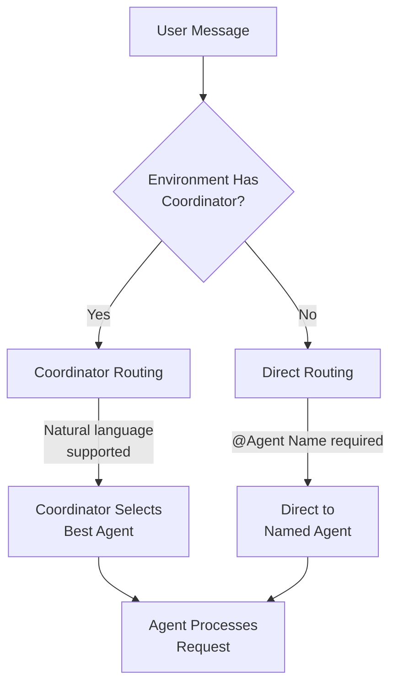

# Teneo Protocol SDK

**Connect your app to the Teneo AI Agent Network**

[](https://www.npmjs.com/package/@teneo-protocol/sdk)
[](https://www.typescriptlang.org/)
[](https://nodejs.org/)
[](/)

The Teneo Protocol SDK lets you connect your application to a **decentralized network of specialized AI agents**. Instead of calling a single AI model, your app taps into an entire ecosystem where:

- 🤖 **Multiple AI agents** with different specializations handle your requests
- 🧠 **Intelligent routing** automatically selects the best agent for each query
- 🔐 **Web3-native authentication** using Ethereum wallet signatures (no API keys!)

---

## 🎉 What's New in v3.0

Version 3.0 introduces **API Naming Improvements** for better clarity and consistency:

### 📝 Clearer Method Names

All method names have been improved to be more explicit and intuitive:

- **Room subscriptions** - `subscribeToPublicRoom()` makes it clear these only work for public rooms
- **Cache-only methods** - `getCached*()` prefix makes sync vs async operations obvious
- **Boolean semantics** - `checkAgentInRoom()` clearly indicates it may return `undefined`
- **Search scope** - `findAvailableAgentsBy*()` clarifies network-wide search

### 🔄 Fully Backward Compatible

**All old method names still work!** They're deprecated with helpful aliases:
- Old names forward to new implementations
- TypeScript shows deprecation warnings
- Migrate at your convenience

[Jump to Migration Guide](#v300-migration-guide) | [See Full CHANGELOG](CHANGELOG.md#300---2026-01-28)

---

## 🚀 Quickstart

### Installation

```bash
pnpm install @teneo-protocol/sdk
```

### Your First Connection

```typescript
import { TeneoSDK } from "@teneo-protocol/sdk";

// 1. Initialize with your Ethereum private key
const sdk = new TeneoSDK({
  wsUrl: "wss://backend.developer.chatroom.teneo-protocol.ai/ws",
  privateKey: "0x..." // Your private key with 0x prefix
});

// 2. Listen for responses
sdk.on("agent:response", (response) => {
  console.log(`${response.agentName}: ${response.humanized}`);
});

// 3. Connect (authenticates automatically)
await sdk.connect();

// 4. Get your private rooms (auto-available after auth)
const rooms = sdk.getRooms();
const roomId = rooms[0].id;

// 5. Send a message to a room

// WITH COORDINATOR (when available):
await sdk.sendMessage("Give me the last 5 tweets from @elonmusk", {
  room: roomId
});
// → Coordinator selects best agent automatically

// WITHOUT COORDINATOR (direct command required):
await sdk.sendMessage("@X Platform Agent search bitcoin 5", {
  room: roomId
});
// → Direct command to specific agent by name
```

**That's it!** After authentication:

1. Your private rooms are automatically available
2. Send messages to any room by ID
3. **With coordinator**: Use natural language - coordinator routes to best agent
4. **Without coordinator**: Use `@Agent Name command params` syntax to target specific agents
5. Responses arrive via the event listener

### Message Routing Flow

The SDK supports two routing approaches depending on your environment:



**Key Differences:**
- **Coordinator environments**: Both natural language and direct commands work
- **Non-coordinator environments**: Must use `@Agent Name command params` syntax

---

## ✨ What's New in v2.3

Version 2.3 introduces **Multi-Network Payment Support**:

### 🌐 Multi-Network Support

- **Multiple EVM chains** - PEAQ, Base, and Avalanche networks supported
- **Automatic network detection** - SDK automatically uses the correct network configuration
- **Network utilities** - Query supported networks, get network configs, validate chains
- **Backward compatible** - Existing code continues to work without changes

Supported networks:
- **PEAQ Mainnet** (chainId: 3338) - Original network
- **Base Mainnet** (chainId: 8453) - Layer 2 scaling solution  
- **Avalanche Mainnet** (chainId: 43114) - High-throughput blockchain

[Jump to Multi-Network Configuration](#multi-network-support-v23)

---

## ✨ What's New in v2.2

Version 2.2 introduces the **Quote-Approve Payment Flow** with x402 protocol support:

### 💰 Payment Flow (Quote-Approve)

- **Automatic payment handling** - SDK handles the full quote → confirm → pay cycle
- **x402 Protocol** - Industry-standard payment headers (Coinbase x402)
- **USDC on PEAQ** - Payments settle on PEAQ network (Chain ID 3338)
- **Price limits** - Set maximum price per request for safety

[Jump to Payment Flow API](#-payment-flow-api)

---

## ✨ What's New in v2.0

Version 2.0 introduces powerful **room management** and **agent customization** capabilities:

### 🏠 Multi-Room Management

- **Create multiple rooms** for different contexts (crypto, gaming, research, etc.)
- **Update and delete** your owned rooms
- **Track room limits** based on your subscription tier
- **Invite members** to your rooms (coming soon)

### 🤖 Agent Room Management

- **Customize which agents** are available in each room
- **Add/remove agents** from your owned rooms
- **List room agents** with caching for performance
- **Real-time agent status updates** for room availability

### 📊 Enhanced APIs

- 8 new room management methods
- 8 new agent-room management methods
- 14 new events for room and agent operations
- Intelligent caching with 5-minute TTL

[Jump to Room Management API](#-room-management-api) | [Jump to Agent Room Management API](#-agent-room-management-api)

---

## How It Works

### 1. Agent Network Architecture

```
Your App
    ↓
Teneo SDK (This library)
    ↓
WebSocket Connection
    ↓
Teneo Coordinator ──→ Selects best agent
    ↓
┌─────────┬─────────┬─────────┬─────────┐
│    X    │Analytics│ Reddit  │ Custom  │
│  Agent  │  Agent  │  Agent  │ Agents  │
└─────────┴─────────┴─────────┴─────────┘
```

### 3. Web3 Authentication

Unlike traditional APIs with API keys, Teneo uses **Ethereum wallet signatures**:

```typescript
// Challenge-response authentication flow:
// 1. SDK connects to Teneo network
// 2. Server sends random challenge string
// 3. SDK signs: "Teneo authentication challenge: {challenge}"
// 4. Server verifies signature against your wallet address
// 5. ✅ Authenticated! You can now send messages

// Your private key never leaves your machine
```

This enables:

- 🔐 **No API keys to manage** - Your wallet IS your identity

---

## 🎯 Running the Examples

### Setup

```bash
git clone https://github.com/TeneoProtocolAI/teneo-sdk.git
cd teneo-sdk
pnpm install
pnpm run build

# Set credentials
export PRIVATE_KEY=your_private_key
export TENEO_WS_URL=wss://backend.developer.chatroom.teneo-protocol.ai/ws
```

### Production Dashboard Example

The **Production Dashboard** is a comprehensive example showcasing **ALL SDK features** in a real-world web application:

```bash
pnpm example:dashboard
# or
cd examples/production-dashboard && bun run server.ts
```

Then open: **[http://localhost:3000](http://localhost:3000)**

**What it demonstrates:**

- ✅ **Full WebSocket Integration** - Connection, authentication, auto-reconnection
- ✅ **Room Management (v2.0)** - Create, update, delete rooms with ownership tracking
- ✅ **Agent-Room Management (v2.0)** - Add/remove agents, list room agents with caching
- ✅ **Message Sending** - Coordinator-based and direct agent commands
- ✅ **Real-time Updates** - Server-Sent Events (SSE) for live dashboard
- ✅ **Agent Discovery** - List agents with capabilities and status
- ✅ **Secure Private Key Handling** - AES-256-GCM encryption in memory
- ✅ **Webhook Integration** - Real-time event streaming with circuit breaker
- ✅ **Health Monitoring** - `/health` and `/metrics` endpoints
- ✅ **Complete Event System** - All SDK events with real-time UI updates

Built with **Hono** (fast web framework) and **Bun** (fast JavaScript runtime). See `examples/production-dashboard/README.md` for details.

---

## 📖 Complete Examples

### Example 1: Request-Response Pattern

Wait for specific responses with timeout:

```typescript
const sdk = new TeneoSDK({
  wsUrl: process.env.TENEO_WS_URL!,
  privateKey: process.env.PRIVATE_KEY!
});

await sdk.connect();

// Wait for response (blocks until agent responds or timeout)
const response = await sdk.sendMessage("Give me the last 5 tweets from @elonmusk?", {
  waitForResponse: true,
  timeout: 30000, // 30 seconds
  format: "both" // Get both raw data and humanized text
});

console.log("Agent:", response.agentName);
console.log("Answer:", response.humanized);
console.log("Raw data:", response.raw);

// Output:
// Agent: X Agent
// Answer:  Timeline for @elonmusk (5 tweets) ...
```

### Example 2: Multi-Room System

Organize agents by context using rooms:

```typescript
const sdk = new TeneoSDK({
  wsUrl: process.env.TENEO_WS_URL!,
  privateKey: process.env.PRIVATE_KEY!,
  autoJoinPublicRooms: ["crawler-room-id", "kol-tracker-room-id"] // public rooms only
});

// Each room may have different agents available
// Note: Private rooms are automatically available after auth
await sdk.connect();

// Send to specific room contexts

// WITH COORDINATOR:
await sdk.sendMessage("Get latest tweets from @elonmusk", { room: "kol-tracker-room-id" });
// → Coordinator routes to best agent in room

await sdk.sendMessage("Crawl this website for data", { room: "crawler-room-id" });
// → Coordinator routes to best agent in room

// WITHOUT COORDINATOR (direct commands required):
await sdk.sendMessage("@X Platform Agent timeline @elonmusk 5", { room: "kol-tracker-room-id" });
// → Direct to X Platform Agent in room

await sdk.sendMessage("@Web Crawler Agent crawl https://example.com", { room: "crawler-room-id" });
// → Direct to Web Crawler Agent in room

// Manage rooms dynamically
const rooms = sdk.getSubscribedRooms();
console.log("Active rooms:", rooms);
// Output: Active rooms: ['crawler-room-id', 'kol-tracker-room-id']
```

### Example 3: Webhook Integration

Receive agent responses via HTTP POST to your server:

```typescript
// Your webhook endpoint (Express)
import express from "express";
const app = express();
app.use(express.json());

app.post("/teneo-webhook", (req, res) => {
  const { event, data, timestamp } = req.body;

  if (event === "task_response") {
    console.log(`Agent: ${data.agentName}`);
    console.log(`Message: ${data.content}`);

    // Save to your database
    db.saveAgentResponse({
      agentId: data.agentId,
      content: data.content,
      timestamp: new Date(timestamp)
    });
  }

  res.sendStatus(200);
});

app.listen(8080);

// Teneo SDK with webhook
const sdk = new TeneoSDK({
  wsUrl: process.env.TENEO_WS_URL!,
  privateKey: process.env.PRIVATE_KEY!,
  webhookUrl: "https://your-webhook.com/",
  webhookHeaders: {
    Authorization: "Bearer your-secret-token"
  }
});

// Monitor webhook delivery
sdk.on("webhook:sent", () => console.log("📤 Webhook sent"));
sdk.on("webhook:success", () => console.log("✅ Webhook delivered"));
sdk.on("webhook:error", (error) => {
  console.error("❌ Webhook failed:", error.message);
  // Circuit breaker will automatically retry
});

await sdk.connect();

// Check webhook health
const status = sdk.getWebhookStatus();
console.log("Pending:", status.queue.pending);
console.log("Circuit state:", status.queue.circuitState); // OPEN/CLOSED/HALF_OPEN
```

---

## WebSocket Endpoints

The Teneo SDK supports two deployment environments via different WebSocket endpoints:

### Development Platform (Testing)

- **URL**: `wss://backend.developer.chatroom.teneo-protocol.ai/ws`
- **Whitelist**: Not required - open for testing
- **Use case**: Development, testing, and experimentation

**Configuration:**
```bash
# .env file
TENEO_WS_URL=wss://backend.developer.chatroom.teneo-protocol.ai/ws
```

### Production Platform (B2B)

- **URL**: `wss://backend.chatroom.teneo-protocol.ai/ws`
- **Whitelist**: **Required** - you must be whitelisted to use this endpoint
- **Use case**: Production applications and B2B integrations
- **Get access**: Request whitelist access at [https://teneo-protocol.ai/data-access](https://teneo-protocol.ai/data-access)

**Configuration:**
```bash
# .env file
TENEO_WS_URL=wss://backend.chatroom.teneo-protocol.ai/ws
```


> **Note**: The SDK uses the **development endpoint by default**. For production use, you need to be whitelisted and explicitly configure the production URL. Use the development endpoint for testing without restrictions.

---
## 🏠 Room Management API

Create and manage multiple rooms for different contexts and use cases.

### Creating Rooms

```typescript
// Create a new room
const room = await sdk.createRoom({
  name: "Crypto Research",
  description: "Room for crypto analysis"
});
console.log(`Created room: ${room.id}`);

// Check if you can create more rooms
if (sdk.canCreateRoom()) {
  await sdk.createRoom({ name: "Gaming Room" });
} else {
  console.log(`Room limit reached: ${sdk.getOwnedRoomCount()}/${sdk.getRoomLimit()}`);
}
```

### Querying Rooms

```typescript
// Get all owned rooms (rooms you created)
const ownedRooms = sdk.getOwnedRooms();
console.log(`You own ${ownedRooms.length} rooms:`);
ownedRooms.forEach((room) => {
  console.log(`  - ${room.name} (${room.is_public ? "Public" : "Private"})`);
});

// Get shared rooms (rooms you were invited to)
const sharedRooms = sdk.getSharedRooms();
console.log(`You have access to ${sharedRooms.length} shared rooms`);

// Get all rooms (owned + shared)
const allRooms = sdk.getAllRooms();
console.log(`Total rooms accessible: ${allRooms.length}`);

// Get specific room by ID
const room = sdk.getRoom("room-123");
if (room) {
  console.log(`Room: ${room.name}`);
  console.log(`Created by: ${room.created_by}`);
  console.log(`You are ${room.is_owner ? "owner" : "member"}`);
}

// Check room limits
console.log(`Room capacity: ${sdk.getOwnedRoomCount()}/${sdk.getRoomLimit()}`);
```

### Updating Rooms

```typescript
// Update room details (owner only)
const updated = await sdk.updateRoom("room-123", {
  name: "Updated Room Name",
  description: "New description"
});

console.log(`Room updated: ${updated.name}`);
```

### Deleting Rooms

```typescript
// Delete a room you own
await sdk.deleteRoom("room-123");
console.log("Room deleted");

// Listen for deletion events
sdk.on("room:deleted", (roomId) => {
  console.log(`Room ${roomId} was deleted`);
});
```

### Room Events

```typescript
// Room lifecycle events
sdk.on("room:created", (room) => {
  console.log(`✅ Created: ${room.name}`);
});

sdk.on("room:updated", (room) => {
  console.log(`📝 Updated: ${room.name}`);
});

sdk.on("room:deleted", (roomId) => {
  console.log(`🗑️ Deleted: ${roomId}`);
});

// Error handling
sdk.on("room:create_error", (error) => {
  console.error(`Failed to create room: ${error.message}`);
});

sdk.on("room:update_error", (error, roomId) => {
  console.error(`Failed to update room ${roomId}: ${error.message}`);
});

sdk.on("room:delete_error", (error, roomId) => {
  console.error(`Failed to delete room ${roomId}: ${error.message}`);
});
```

---

## 🤖 Agent Room Management API

Customize which agents are available in each of your rooms.

### Adding Agents to Rooms

```typescript
// Add an agent to your room (owner only)
await sdk.addAgentToRoom("room-123", "agent-456");
console.log("Agent added to room");

// Listen for confirmation
sdk.on("agent_room:agent_added", (roomId, agentId) => {
  console.log(`✅ Agent ${agentId} added to room ${roomId}`);
});
```

### Removing Agents from Rooms

```typescript
// Remove an agent from your room (owner only)
await sdk.removeAgentFromRoom("room-123", "agent-456");
console.log("Agent removed from room");

// Listen for confirmation
sdk.on("agent_room:agent_removed", (roomId, agentId) => {
  console.log(`🗑️ Agent ${agentId} removed from room ${roomId}`);
});
```

### Listing Room Agents

```typescript
// List all agents in a room (with 5-minute cache)
const roomAgents = await sdk.listRoomAgents("room-123");
console.log(`${roomAgents.length} agents in this room:`);
roomAgents.forEach((agent) => {
  console.log(`  - ${agent.agent_name} (${agent.status})`);
  if (agent.capabilities) {
    console.log(`    Capabilities: ${agent.capabilities.map((c) => c.name).join(", ")}`);
  }
});

// Force refresh (bypass cache)
const freshAgents = await sdk.listRoomAgents("room-123", false);
```

### Listing Available Agents

```typescript
// List agents NOT yet in the room (available to add)
const available = await sdk.listAvailableAgents("room-123");
console.log(`${available.length} agents available to add:`);
available.forEach((agent) => {
  console.log(`  - ${agent.agent_name}`);
  if (agent.description) {
    console.log(`    ${agent.description}`);
  }
});
```

### Query Methods (Synchronous - from cache)

```typescript
// Check if specific agent is in room (instant, no network call)
const inRoom = sdk.checkAgentInRoom("room-123", "agent-456");
if (inRoom === true) {
  console.log("Agent is in the room");
} else if (inRoom === false) {
  console.log("Agent is NOT in the room");
} else {
  console.log("Cache not available - call listRoomAgents() first");
}

// Get room agent count (instant)
const count = sdk.getCachedRoomAgentCount("room-123");
if (count !== undefined) {
  console.log(`Room has ${count} agents`);
}

// Get cached room agents (instant)
const cached = sdk.getCachedRoomAgents("room-123");
if (cached) {
  console.log("Agents:", cached.map((a) => a.agent_name).join(", "));
} else {
  console.log("No cached data - call listRoomAgents() first");
}

// Get cached available agents (instant)
const cachedAvailable = sdk.getCachedAvailableAgents("room-123");
```

### Cache Management

```typescript
// Caching behavior:
// - listRoomAgents() and listAvailableAgents() cache results for 5 minutes
// - Cache automatically invalidated when you add/remove agents
// - Cache automatically invalidated on agent status updates

// Manual cache invalidation (if needed)
sdk.invalidateAgentRoomCache("room-123");
console.log("Cache cleared for room-123");
```

### Agent Room Events

```typescript
// Agent add/remove events
sdk.on("agent_room:agent_added", (roomId, agentId) => {
  console.log(`✅ Agent ${agentId} added to ${roomId}`);
});

sdk.on("agent_room:agent_removed", (roomId, agentId) => {
  console.log(`🗑️ Agent ${agentId} removed from ${roomId}`);
});

// List events
sdk.on("agent_room:agents_listed", (roomId, agents) => {
  console.log(`📋 ${agents.length} agents in room ${roomId}`);
});

sdk.on("agent_room:available_agents_listed", (agents) => {
  console.log(`📋 ${agents.length} agents available to add`);
});

// Status updates (real-time)
sdk.on("agent_room:status_update", (data) => {
  console.log(`🔄 Agent ${data.agentId} status updated in room ${data.roomId}`);
  console.log(`   New status: ${data.status}`);
});

// Error handling
sdk.on("agent_room:add_error", (error, roomId) => {
  console.error(`Failed to add agent to ${roomId}: ${error.message}`);
});

sdk.on("agent_room:remove_error", (error, roomId) => {
  console.error(`Failed to remove agent from ${roomId}: ${error.message}`);
});

sdk.on("agent_room:list_error", (error, roomId) => {
  console.error(`Failed to list agents in ${roomId}: ${error.message}`);
});

sdk.on("agent_room:list_available_error", (error) => {
  console.error(`Failed to list available agents: ${error.message}`);
});
```

### Complete Example: Room Setup

```typescript
// Complete workflow: Create room and customize agents
async function setupCustomRoom() {
  // 1. Create a new room
  const room = await sdk.createRoom({
    name: "My Custom Room",
    description: "Specialized agent room"
  });
  console.log(`✅ Created room: ${room.id}`);

  // 2. See what agents are available
  const available = await sdk.listAvailableAgents(room.id);
  console.log(`${available.length} agents available`);

  // 3. Add specific agents you want
  const cryptoAgent = available.find((a) => a.agent_name?.includes("Crypto"));
  if (cryptoAgent) {
    await sdk.addAgentToRoom(room.id, cryptoAgent.agent_id);
    console.log(`✅ Added ${cryptoAgent.agent_name}`);
  }

  const analyticsAgent = available.find((a) => a.agent_name?.includes("Analytics"));
  if (analyticsAgent) {
    await sdk.addAgentToRoom(room.id, analyticsAgent.agent_id);
    console.log(`✅ Added ${analyticsAgent.agent_name}`);
  }

  // 4. Verify room configuration
  const roomAgents = await sdk.listRoomAgents(room.id);
  console.log(`\n🎯 Room configured with ${roomAgents.length} agents:`);
  roomAgents.forEach((agent) => {
    console.log(`   - ${agent.agent_name}`);
  });

  // 5. Now send messages to this room
  await sdk.sendMessage("Analyze BTC price trends", { room: room.id });
}

setupCustomRoom();
```

---

## 💰 Payment Flow API

The SDK supports automatic micropayments to AI agents using the x402 protocol.

### Basic Usage (Auto-Approve)

```typescript
import { TeneoSDK } from "@teneo-protocol/sdk";

// Enable payments with auto-approve
const sdk = new TeneoSDK(
  TeneoSDK.builder()
    .withWebSocketUrl("wss://backend.developer.chatroom.teneo-protocol.ai/ws")
    .withAuthentication(process.env.PRIVATE_KEY!)
    .withPayments({
      autoApprove: true,           // Automatically approve quotes
      maxPricePerRequest: 1000000  // Max 1 USDC per request (in micro-units)
    })
    .build()
);

await sdk.connect();

// Send message - payment handled automatically
const response = await sdk.sendMessage("@X Platform Agent user @elonmusk", {
  room: roomId,
  waitForResponse: true
});

console.log(response.humanized);
// Output: User profile for @elonmusk...
```

> **Note:** The builder uses `withPayments({ autoApprove: true })` while the plain config object uses `autoApproveQuotes: true`. Both control the same behavior. The builder also accepts `maxPricePerRequest` and `quoteTimeout`.

### Multi-Network Support (v2.3)

The SDK supports USDC payments across multiple EVM networks. Each network has its own USDC contract, settlement router, and transfer hook addresses.

#### Querying Network Information

```typescript
import {
  NETWORKS,
  getNetwork,
  getDefaultNetwork,
  getSupportedNetworks,
  isNetworkSupported,
  createChainDefinition
} from "@teneo-protocol/sdk";

// Get all supported networks
const networks = getSupportedNetworks();
console.log(networks); // ["peaq", "base", "avalanche"]

// Get specific network config
const baseNetwork = getNetwork("base");
console.log(baseNetwork);
// {
//   chainId: 8453,
//   name: "Base Mainnet",
//   caip2: "eip155:8453",
//   rpcUrl: "https://mainnet.base.org",
//   usdcContract: "0x833589fCD6eDb6E08f4c7C32D4f71b54bdA02913",
//   settlementRouter: "0x73fc659Cd5494E69852bE8D9D23FE05Aab14b29B",
//   transferHook: "0x081258287F692D61575387ee2a4075f34dd7Aef7",
//   eip712: { name: "USD Coin", version: "2" }
// }

// Check if a network is supported
if (isNetworkSupported("base")) {
  // Create a viem chain definition
  const baseChain = createChainDefinition("base");
  // Use with PaymentClient or other viem-based operations
}

// Get default network (PEAQ)
const defaultNetwork = getDefaultNetwork();
```

#### Network Details

All supported networks with their contract addresses:

```typescript
import { NETWORKS } from "@teneo-protocol/sdk";

// PEAQ Mainnet (chainId: 3338)
console.log(NETWORKS.peaq);
// {
//   usdcContract: "0xbbA60da06c2c5424f03f7434542280FCAd453d10",
//   settlementRouter: "0xCD57f4596f70b18a0fd0c42daa4F3066d3adc8d4",
//   transferHook: "0xf45FA7713a58eBd0C353186F9e49A7C39a0eD34E"
// }

// Base Mainnet (chainId: 8453)
console.log(NETWORKS.base);
// {
//   usdcContract: "0x833589fCD6eDb6E08f4c7C32D4f71b54bdA02913",
//   settlementRouter: "0x73fc659Cd5494E69852bE8D9D23FE05Aab14b29B",
//   transferHook: "0x081258287F692D61575387ee2a4075f34dd7Aef7"
// }

// Avalanche Mainnet (chainId: 43114)
console.log(NETWORKS.avalanche);
// {
//   usdcContract: "0xB97EF9Ef8734C71904D8002F8b6Bc66Dd9c48a6E",
//   settlementRouter: "0xF38709cFd3f89734c231dd8E59Ff1d44caCddEe8",
//   transferHook: "0x6D21298950dC58a984664B12Cdf4DeBA143889aa"
// }
```

> **Note:** The SDK automatically handles network selection. The payment server determines which network to use based on the agent's configuration. You don't need to manually configure networks unless you're using the `PaymentClient` directly for custom payment operations.

#### Configuring Default Payment Network

You can configure which network to use for all payments in three ways:

**Option 1: Using Environment Variable (Global Default)**

```bash
# Set default network for all payments
export TENEO_NETWORK=base

# Or use chain ID
export TENEO_NETWORK=8453

# Or use CAIP-2 format
export TENEO_NETWORK=eip155:8453
```

```typescript
import { TeneoSDK } from "@teneo-protocol/sdk";

// SDK automatically uses TENEO_NETWORK env var
const sdk = new TeneoSDK(
  TeneoSDK.builder()
    .withWebSocketUrl("wss://backend.developer.chatroom.teneo-protocol.ai/ws")
    .withAuthentication(process.env.PRIVATE_KEY!)
    .withPayments({ autoApprove: true })
    .build()
);

// All payments will use Base network (from TENEO_NETWORK)
```

**Option 2: Using Config Builder (Per-SDK Instance)**

```typescript
import { TeneoSDK } from "@teneo-protocol/sdk";

// Configure Base network for this SDK instance
const sdk = new TeneoSDK(
  TeneoSDK.builder()
    .withWebSocketUrl("wss://backend.developer.chatroom.teneo-protocol.ai/ws")
    .withAuthentication(process.env.PRIVATE_KEY!)
    .withPayments({ autoApprove: true })
    .withNetwork("base")  // Use Base Mainnet
    .build()
);

// All payments from this SDK will use Base network
```

Or using chain ID:

```typescript
const sdk = new TeneoSDK(
  TeneoSDK.builder()
    .withWebSocketUrl("wss://backend.developer.chatroom.teneo-protocol.ai/ws")
    .withAuthentication(process.env.PRIVATE_KEY!)
    .withPayments({ autoApprove: true })
    .withNetworkChainId(43114)  // Use Avalanche (chain ID 43114)
    .build()
);
```

**Network Selection Priority:**

The SDK uses this priority order for network selection:
1. Per-request network override (if supported by future versions)
2. Builder `.withNetwork()` or `.withNetworkChainId()` setting
3. `TENEO_NETWORK` environment variable
4. Default: PEAQ network (eip155:3338)

**Example: Multiple SDK Instances with Different Networks**

```typescript
// Production bot uses PEAQ
const peaqBot = new TeneoSDK(
  TeneoSDK.builder()
    .withWebSocketUrl("wss://backend.developer.chatroom.teneo-protocol.ai/ws")
    .withAuthentication(process.env.PEAQ_PRIVATE_KEY!)
    .withPayments({ autoApprove: true })
    .withNetwork("peaq")
    .build()
);

// Experimental bot uses Base
const baseBot = new TeneoSDK(
  TeneoSDK.builder()
    .withWebSocketUrl("wss://backend.developer.chatroom.teneo-protocol.ai/ws")
    .withAuthentication(process.env.BASE_PRIVATE_KEY!)
    .withPayments({ autoApprove: true })
    .withNetwork("base")
    .build()
);

// High-throughput bot uses Avalanche
const avalancheBot = new TeneoSDK(
  TeneoSDK.builder()
    .withWebSocketUrl("wss://backend.developer.chatroom.teneo-protocol.ai/ws")
    .withAuthentication(process.env.AVALANCHE_PRIVATE_KEY!)
    .withPayments({ autoApprove: true })
    .withNetwork("avalanche")
    .build()
);
```

### Direct Agent Commands

#### When to Use Direct Commands

Direct agent commands allow you to target a specific agent by name using the `@Agent Name command params` syntax:

- **Required** in non-coordinator environments (direct commands are the only way to communicate)
- **Optional** in coordinator environments (gives you explicit control over which agent handles the request)

#### Syntax Options

```typescript
// Option 1: Use @mention syntax via sendMessage (recommended)
await sdk.sendMessage("@X Platform Agent search bitcoin 5", {
  room: roomId,
  waitForResponse: true
});

// Option 2: Use sendDirectCommand for programmatic control
const response = await sdk.sendDirectCommand({
  agent: "X Platform Agent",
  command: "timeline @elonmusk 5",
  room: roomId
}, true); // waitForResponse

console.log(response.humanized);

// Option 3: Fire-and-forget (no wait for response)
await sdk.sendDirectCommand({
  agent: "X Platform Agent",
  command: "user @elonmusk",
  room: roomId
});
```

#### Environment-Specific Examples

```typescript
// IN COORDINATOR ENVIRONMENTS (both work):

// Natural language - coordinator selects best agent
await sdk.sendMessage("Get me the latest tweets from @elonmusk", {
  room: roomId,
  waitForResponse: true
});

// Direct command - explicit agent selection
await sdk.sendMessage("@X Platform Agent timeline @elonmusk 5", {
  room: roomId,
  waitForResponse: true
});

// IN NON-COORDINATOR ENVIRONMENTS (direct commands required):

// Direct command - MUST specify agent name
await sdk.sendMessage("@X Platform Agent search bitcoin 5", {
  room: roomId,
  waitForResponse: true
});

// This will NOT work without coordinator:
// ❌ await sdk.sendMessage("Get bitcoin info", { room: roomId });
```

### Payment Events

```typescript
// Quote received from agent
sdk.on("quote:received", (quote) => {
  console.log(`Quote: ${quote.data.pricing.pricePerUnit} USDC`);
  console.log(`Agent: ${quote.data.agent_name}`);
  console.log(`Expires: ${quote.data.expires_at}`);
});

// Payment attached to request
sdk.on("payment:attached", (data) => {
  console.log(`Paid ${data.amount / 1_000_000} USDC to ${data.agentId}`);
});

// Payment blocked (price exceeds maxPricePerRequest)
sdk.on("payment:blocked", (data) => {
  console.warn(`Payment blocked: agent ${data.agentId} charges ${data.agentPrice} but max is ${data.maxPrice}`);
});

// Payment errors
sdk.on("payment:error", (error) => {
  console.error(`Payment failed: ${error.message}`);
});
```

### Manual Quote Approval

```typescript
const sdk = new TeneoSDK(
  TeneoSDK.builder()
    .withWebSocketUrl("wss://...")
    .withAuthentication(privateKey)
    .withPayments({
      autoApprove: false  // Require manual approval
    })
    .build()
);

// Listen for quotes
sdk.on("quote:received", async (quote) => {
  const price = quote.data.pricing.pricePerUnit;

  // Check price before approving
  if (price <= 0.01) {
    // Approve and send payment
    await sdk.confirmQuote(quote.data.task_id);
  } else {
    console.log(`Quote too expensive: $${price}`);
  }
});

// Request triggers quote
await sdk.sendMessage("@X Platform Agent user @elonmusk", { room: roomId });
```

### Payment Flow Diagram

```
Your App                    Teneo Backend                 Agent
   │                             │                          │
   │──── request_task ──────────>│                          │
   │                             │────── select agent ─────>│
   │<───── task_quote ───────────│<────── pricing ──────────│
   │                             │                          │
   │  [Auto-approve or manual]   │                          │
   │                             │                          │
   │──── confirm_task ──────────>│                          │
   │     + x402 payment header   │────── execute task ─────>│
   │                             │                          │
   │<───── task_response ────────│<────── response ─────────│
   │                             │                          │
   │                             │──── settle payment ─────>│
   └                             └                          └
```

---

## 🎨 Event System

The SDK is fully event-driven. Subscribe to what matters:

### Connection & Authentication

```typescript
sdk.on("connection:open", () => console.log("🔌 WebSocket connected"));
sdk.on("connection:close", (code, reason) => console.log(`❌ Disconnected: ${reason}`));
sdk.on("connection:reconnecting", (attempt) => console.log(`🔄 Reconnecting (attempt ${attempt})`));

sdk.on("auth:challenge", (challenge) =>
  console.log("🔐 Challenge received, signing with wallet...")
);
sdk.on("auth:success", (state) => {
  console.log(`✅ Authenticated as ${state.walletAddress}`);
  console.log(`Whitelisted: ${state.isWhitelisted}`);
});
sdk.on("auth:error", (error) => console.error("❌ Auth failed:", error));
```

### Agent Events

```typescript
sdk.on("agent:selected", (selection) => {
  console.log(`🤖 ${selection.agentName} was selected by coordinator`);
  console.log(`Reasoning: ${selection.reasoning}`);
});

sdk.on("agent:response", (response) => {
  console.log(`💬 ${response.agentName}: ${response.humanized}`);
});

sdk.on("agent:list", (agents) => {
  console.log(`📋 Agent list updated: ${agents.length} agents available`);
  agents.forEach((agent) => {
    console.log(`  - ${agent.name}: ${agent.capabilities?.map(c => c.name).join(", ")}`);
  });
});
```

### Room Events

```typescript
sdk.on("room:subscribed", (data) => {
  console.log(`✅ Joined room: ${data.roomId}`);
  console.log(`All subscribed rooms: ${data.subscriptions.join(", ")}`);
});

sdk.on("room:unsubscribed", (data) => {
  console.log(`👋 Left room: ${data.roomId}`);
});
```

---

## ⚙️ Configuration

### Simple Configuration

```typescript
const sdk = new TeneoSDK({
  wsUrl: "wss://backend.developer.chatroom.teneo-protocol.ai/ws",
  privateKey: "0x...", // Your private key
  autoJoinPublicRooms: ["room-id-1"],
  reconnect: true,
  logLevel: "info"
});
```

### Advanced Configuration (Builder Pattern)

```typescript
import { SDKConfigBuilder, SecurePrivateKey } from "@teneo-protocol/sdk";

// Encrypt private key in memory (AES-256-GCM)
const secureKey = new SecurePrivateKey(process.env.PRIVATE_KEY!);

const config = new SDKConfigBuilder()
  // Required
  .withWebSocketUrl("wss://backend.developer.chatroom.teneo-protocol.ai/ws")
  .withAuthentication(secureKey) // Encrypted key

  // Rooms - auto-join these public rooms on connect
  .withAutoJoinPublicRooms(["room-id-1", "room-id-2"]) // Public rooms only (private rooms auto-available)

  // Reconnection strategy
  .withReconnectionStrategy({
    type: "exponential",
    baseDelay: 3000, // Start at 3 seconds
    maxDelay: 120000, // Cap at 2 minutes
    maxAttempts: 20,
    jitter: true // Prevent thundering herd
  })

  // Webhook with retry
  .withWebhook("https://your-server.com/webhook", {
    Authorization: "Bearer token"
  })
  .withWebhookRetryStrategy({
    type: "exponential",
    baseDelay: 1000,
    maxDelay: 30000,
    maxAttempts: 5
  })

  // Response formatting
  .withResponseFormat({
    format: "both", // 'raw' | 'humanized' | 'both'
    includeMetadata: true
  })

  // Security
  .withSignatureVerification({
    enabled: true,
    trustedAddresses: ["0xAgent1...", "0xAgent2..."],
    requireFor: ["task_response"]
  })

  // Performance
  .withMessageDeduplication(true, 60000, 10000)
  .withLogging("debug")

  .build();

const sdk = new TeneoSDK(config);
```

### Environment Variables

Create `.env`:

```bash
# Required
TENEO_WS_URL=wss://backend.developer.chatroom.teneo-protocol.ai/ws
PRIVATE_KEY=0xYourPrivateKey

# Optional
LOG_LEVEL=info

# Payment network (v2.3.0) - Optional, defaults to PEAQ
TENEO_NETWORK=base                # By name: peaq, base, avalanche
# Or by chain ID: TENEO_NETWORK=8453
# Or CAIP-2: TENEO_NETWORK=eip155:8453
```

Load them:

```typescript
import * as dotenv from "dotenv";
dotenv.config();

const sdk = new TeneoSDK({
  wsUrl: process.env.TENEO_WS_URL!,
  privateKey: process.env.PRIVATE_KEY!,
  logLevel: (process.env.LOG_LEVEL as any) || "info"
  // TENEO_NETWORK is automatically used by SDK for payment network
});
```

---

## 🔄 v3.0.0 Migration Guide

All v3.0.0 changes are **backward compatible**. Old method names still work via deprecated aliases.

### Quick Migration (Optional)

Search and replace across your codebase to use the new, clearer names:

```bash
# Config property
autoJoinRooms: → autoJoinPublicRooms:

# Room subscription methods
.subscribeToRoom( → .subscribeToPublicRoom(
.unsubscribeFromRoom( → .unsubscribeFromPublicRoom(

# Cache-only methods (sync)
.getRoomAgents( → .getCachedRoomAgents(
.getAvailableAgents( → .getCachedAvailableAgents(
.getRoomAgentCount( → .getCachedRoomAgentCount(

# Boolean check methods
.isAgentInRoom( → .checkAgentInRoom(

# Network-wide search methods
.findAgentsByCapability( → .findAvailableAgentsByCapability(
.findAgentsByName( → .findAvailableAgentsByName(
.findAgentsByStatus( → .findAvailableAgentsByStatus(
```

### Why These Changes?

**Room Subscriptions**: `subscribeToPublicRoom()` clarifies that only public rooms need subscription. Private rooms are automatically available after authentication.

**Cache Methods**: The `getCached*` prefix makes it obvious these are synchronous, cache-only operations. Async methods like `listRoomAgents()` still fetch from server.

**Boolean Checks**: `checkAgentInRoom()` returns `boolean | undefined`, not just boolean. The name clarifies this uncertainty.

**Search Scope**: `findAvailableAgentsBy*()` methods search ALL available agents network-wide, not just room-specific agents.

### No Rush!

- ✅ Old names work indefinitely
- ✅ TypeScript/JSDoc shows deprecation hints
- ✅ Migrate on your schedule
- ✅ Zero functional changes

See [CHANGELOG.md](CHANGELOG.md#300---2026-01-28) for detailed explanations and examples.

---

## 🛡️ Production Features

### 1. Secure Private Key Management

Your Ethereum private key is **encrypted in memory** with AES-256-GCM:

```typescript
import { SecurePrivateKey } from "@teneo-protocol/sdk";

// Immediately encrypted on construction
const secureKey = new SecurePrivateKey(process.env.PRIVATE_KEY!);

const sdk = new TeneoSDK({
  wsUrl: "...",
  privateKey: secureKey // Pass encrypted key
});

// Key lifecycle:
// 1. Encrypted in memory with AES-256-GCM
// 2. Only decrypted temporarily during signing
// 3. Zeroed from memory immediately after use
// 4. Auto-cleanup on disconnect
```

### 2. Circuit Breaker Pattern

Prevents cascading failures in webhook delivery:

```typescript
const status = sdk.getWebhookStatus();

console.log("Circuit state:", status.queue.circuitState);
// CLOSED = Normal operation, webhooks being delivered
// OPEN = Too many failures, failing fast (60s timeout)
// HALF_OPEN = Testing recovery (2 successes → CLOSED)

// Circuit opens after 5 consecutive failures
// Automatically retries after 60 seconds
// Closes after 2 successful deliveries

// State transitions:
// CLOSED --[5 failures]--> OPEN --[60s]--> HALF_OPEN --[2 successes]--> CLOSED
```

### 3. Retry Strategies

Configurable exponential backoff, linear, or constant delays:

| Strategy        | Formula               | Example (base=2s, mult=2) |
| --------------- | --------------------- | ------------------------- |
| **Exponential** | `base * mult^attempt` | 2s, 4s, 8s, 16s, 32s      |
| **Linear**      | `base * attempt`      | 2s, 4s, 6s, 8s, 10s       |
| **Constant**    | `base`                | 2s, 2s, 2s, 2s, 2s        |

```typescript
const config = new SDKConfigBuilder()
  .withReconnectionStrategy({
    type: "exponential",
    baseDelay: 3000,
    maxDelay: 120000,
    maxAttempts: 20,
    jitter: true // Add 0-1000ms randomness
  })
  .build();
```

### 4. Message Deduplication

Prevents duplicate message processing with TTL-based cache:

```typescript
const config = new SDKConfigBuilder()
  .withMessageDeduplication(
    true, // Enable
    300000, // 5 minute TTL
    10000 // Cache up to 10k message IDs
  )
  .build();

// Duplicate messages are automatically filtered
// Useful for preventing replay attacks
// Auto-cleanup at 90% capacity
```

### 6. Signature Verification

Verify agent messages are authentic:

```typescript
const config = new SDKConfigBuilder()
  .withSignatureVerification({
    enabled: true,
    trustedAddresses: ["0xAgent1...", "0xAgent2..."],
    requireFor: ["task_response", "agent_selected"],
    strictMode: false // Only reject types in requireFor
  })
  .build();

sdk.on("signature:verified", (type, address) => {
  console.log(`✅ Verified ${type} from ${address}`);
});

sdk.on("signature:failed", (type, reason) => {
  console.warn(`⚠️ Invalid signature on ${type}: ${reason}`);
});
```

---

## 📊 Monitoring & Health

### Health Check

```typescript
const health = sdk.getHealth();

console.log("Status:", health.status); // 'healthy' | 'degraded' | 'unhealthy'
console.log("Connected:", health.connection.status);
console.log("Authenticated:", health.connection.authenticated);

if (health.webhook) {
  console.log("Webhook pending:", health.webhook.pending);
  console.log("Circuit state:", health.webhook.circuitState);
}

if (health.rateLimit) {
  console.log("Available tokens:", health.rateLimit.availableTokens);
}
```

### Connection State

```typescript
const state = sdk.getConnectionState();

console.log("Connected:", state.connected);
console.log("Authenticated:", state.authenticated);
console.log("Reconnecting:", state.reconnecting);
console.log("Reconnect attempts:", state.reconnectAttempts);
```

### Performance Metrics

```typescript
// Rate limiter status (via health check)
const health = sdk.getHealth();
if (health.rateLimit) {
  console.log("Available:", health.rateLimit.availableTokens);
  console.log("Rate:", health.rateLimit.tokensPerSecond, "/sec");
  console.log("Burst capacity:", health.rateLimit.maxBurst);
}

// Deduplication cache
const dedup = sdk.getDeduplicationStatus();
if (dedup) {
  console.log("Cache size:", dedup.cacheSize);
  console.log("Max size:", dedup.maxSize);
  console.log("Usage:", Math.round((dedup.cacheSize / dedup.maxSize) * 100), "%");
}
```

---

## 🔧 Troubleshooting

### Issue: "ERR_REQUIRE_ESM" Error

**Problem:**

```
Error [ERR_REQUIRE_ESM]: require() of ES Module node-fetch not supported
```

**Solution:** Use the compiled version:

```bash
# ✅ Correct
npm run build
node your-app.js

# ❌ Wrong
npx ts-node your-app.ts
```

**Alternative:** Install node-fetch v2:

```bash
npm install node-fetch@2.7.0
npm run build
```

### Issue: Authentication Failed

**Problem:** Can't authenticate with Teneo network.

**Solutions:**

1. **Check private key format (64 hex characters, + 0x prefix):**

   ```typescript
   // ✅ Good - 64 hex characters after 0x prefix
   privateKey: "0x1234567890123456789012345678901234567890123456789012345678901234";
   ```

2. **Verify key length:**

   ```bash
   echo -n "0x1234...your_key" | wc -c
   # Should output: 66 (0x prefix + 64 hex characters)
   ```

3. **Enable debug logging:**

   ```typescript
   const sdk = new TeneoSDK({
     wsUrl: "...",
     privateKey: "...",
     logLevel: "debug"
   });
   ```

### Issue: Rate Limiting

**Problem:**

```
RateLimitError: Rate limit exceeded
```

**Solutions:**

1. **Slow down requests:**
   ```typescript
   for (const message of messages) {
     await sdk.sendMessage(message, { room: roomId });
     await new Promise((r) => setTimeout(r, 200)); // 200ms delay
   }
   ```

### Issue: Webhook Failures

**Solutions:**

1. **Verify HTTPS (except localhost):**

   ```typescript
   // ✅ Good
   webhookUrl: "https://your-server.com/webhook";
   webhookUrl: "http://localhost:3000/webhook";

   // ❌ Bad
   webhookUrl: "http://your-server.com/webhook";
   ```

2. **Test manually:**

   ```bash
   curl -X POST https://your-server.com/webhook \
     -H "Content-Type: application/json" \
     -d '{"test": true}'
   ```

3. **Check circuit breaker:**
   ```typescript
   const status = sdk.getWebhookStatus();
   if (status.queue.circuitState === "OPEN") {
     console.log("Circuit open, will retry in 60s");
   }
   ```

---

## 🧪 Testing

```bash
npm test                # All tests
npm run test:watch      # Watch mode
npm run test:coverage   # Coverage report
npm run test:unit       # Unit tests only
npm run test:integration # Integration tests
```

**Test Results:**

- ✅ 671 unit tests passing
- ✅ 100% pass rate (Phase 0-2 complete)
- ✅ Comprehensive coverage

---

## 🤝 Contributing

We welcome contributions!

1. Fork the repository
2. Create a feature branch (`git checkout -b feature/amazing-feature`)
3. Make your changes
4. Add tests
5. Run `npm test`
6. Commit (`git commit -m 'Add amazing feature'`)
7. Push (`git push origin feature/amazing-feature`)
8. Open a Pull Request

---

## 📄 License

AGPL-3.0 License

<div align="center">

**Built with ❤️ by the [Teneo Team](https://teneo.pro)**

</div>
